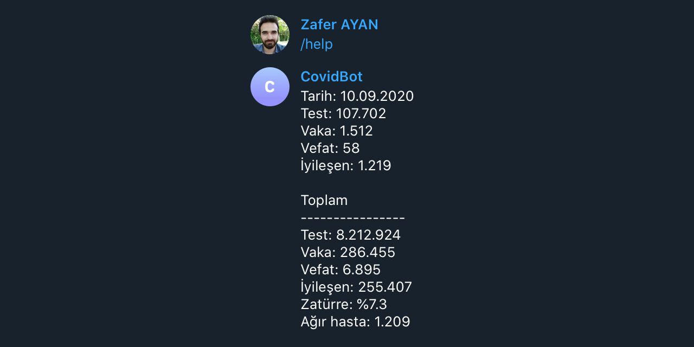

# Covid19 Bot

Covid19 Bot is Github Action that creates Telegram bot and sends Turkey covid info when /help command given.

## Screenshot



## Requirements

1. Telegram bot token generated by [BotFather](https://t.me/botfather).
2. Public or private Github repo.

## Usage

1. Fork this repo.
2. Generate bot via [BotFather](https://t.me/botfather).
3. Go to your forked repo's "Settings" tab and navigate to "Secrets" from left sidebar.
4. Create TELEGRAM_BOT_TOKEN secret according to BotFather's message.

```bash
TELEGRAM_BOT_TOKEN=asdhasjdashdasdasdasd
# for debugging purposes
ACTIONS_STEP_DEBUG=true
```

## Contributing

Pull requests are welcome. For major changes, please open an issue first to discuss what you would like to change.

Please make sure to update tests as appropriate.

## License

[MIT](https://choosealicense.com/licenses/mit/)